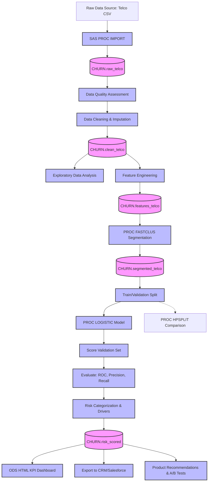

# Section 20: Final Project Architecture & Plan

## End-to-End Architecture Flow



## Complete Project Folder Structure

```text
SAS_Churn_Project/
│
├── Data/
│   ├── Raw/
│   │   └── telco_churn.csv            (Raw dataset)
│   └── Processed/
│       ├── raw_telco.sas7bdat         (Post-import)
│       ├── clean_telco.sas7bdat       (Post-cleaning)
│       ├── features_telco.sas7bdat    (Post-engineering)
│       ├── segmented_telco.sas7bdat   (Post-clustering)
│       └── model_scored.sas7bdat      (Post-modeling)
│
├── SAS_Programs/
│   ├── 00_import_data.sas
│   ├── 01_data_quality.sas
│   ├── 02_data_cleaning.sas
│   ├── 03_eda.sas
│   ├── 04_feature_engineering.sas
│   ├── 05_segmentation.sas
│   ├── 06_churn_model.sas
│   ├── 07_model_evaluation.sas
│   ├── 08_risk_scoring.sas
│   ├── 09_churn_drivers.sas
│   └── 10_dashboard.sas
│
├── Output/
│   ├── customer_risk_report.csv       (Export for CRM)
│   └── Churn_KPI_Dashboard.html       (ODS Dashboard)
│
└── Documentation/
    ├── 01_Business_Problem_and_Requirements.md
    ├── 02_Dataset_Guide.md
    ├── 04_Product_Strategy.md
    └── 05_Deployment_and_Monitoring.md
```

## Realistic 3-Week Implementation Plan

If you were to execute this project in a real-world internship, this is the timeline you would follow:

### Week 1: Data Foundation & Discovery
* **Day 1-2:** Business requirements gathering (Stakeholder interviews, define KPI metrics).
* **Day 3:** Data acquisition and import into SAS (`00_import`).
* **Day 4:** Data quality assessment and cleaning (`01_data_quality`, `02_clean`).
* **Day 5:** Exploratory Data Analysis to identify macro trends (`03_eda`). 
* *Deliverable:* Initial EDA read-out to stakeholders.

### Week 2: Modeling & Segmentation
* **Day 6-7:** Feature engineering and customer segmentation (`04_feature`, `05_segmentation`).
* **Day 8-9:** Model training, tuning, and evaluation (`06_model`, `07_evaluation`).
* **Day 10:** Translating model outputs into risk scores and business drivers (`08_risk`, `09_drivers`).
* *Deliverable:* Model evaluation presentation (focusing on Recall and Business Impact).

### Week 3: Productization & Strategy
* **Day 11-12:** Build automated SAS dashboard (`10_dashboard`).
* **Day 13:** Develop product recommendations and RICE prioritization (`04_Product_Strategy`).
* **Day 14:** Design A/B test experiments for top interventions.
* **Day 15:** Final presentation outlining findings, CRM integration plan, and product roadmap changes.
* *Deliverable:* Executive Dashboard and Product Roadmap Presentation.
